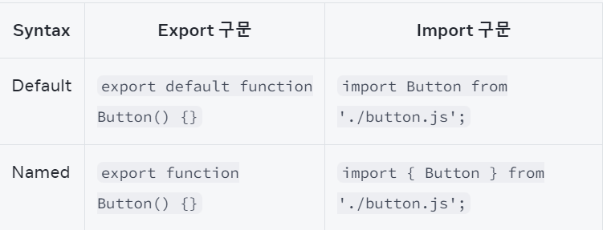

컴포넌트의 가장 큰 장점 = 재사용성  
: 컴포넌트를 조합해 또 다른 컴포넌트를 만들 수 있음  

## Root 컴포넌트
#### App.js
 ```javascript
 function Profile() {
  return (
    
  );
}

export default function Gallery() {
  return (
    <section>
      <h1>Amazing scientists</h1>
      <Profile />
      <Profile />
      <Profile />
    </section>
  );
}

 ```

 Profile, Gallery 컴포넌트들은 모두 App.js라는 root 컴포넌트 파일에 존재한다.

 ## 컴포넌트를 import 하거나 export 하는 방법
 1. 컴포넌트를 추가할 JS 파일 생성
 2. 새로 만든 파일에서 함수 컴포넌트를 **export** 합니다.  
 (**default** 또는  named export 방식 사용)
 3. 컴포넌트를 사용할 파일에서 **import** 합니다.

#### App.js

 ```javascript
 import Gallery from './Gallery.js';

export default function App() {
  return (
    <Gallery />
  );
}
 ```

#### Gallery.js
```javascript
function Profile() {
  return (
    
  );
}

export default function Gallery() {
  return (
    <section>
      <h1>Amazing scientists</h1>
      <Profile />
      <Profile />
      <Profile />
    </section>
  );
}

```

## 한 파일에서 여러 컴포넌트를 import 하거나 export 하는 방법
- 한 파일에서는 단 하나의 default export만 사용할 수 있지만,  
 named export는 여러 번 사용할 수 있다.

 #### App.js

 ```javascript
import Gallery from './Gallery.js';
import { Profile } from './Gallery.js';

export default function App() {
  return (
    <Profile />
  );
}

 ```
 - Gallery.js에서 named import 방식으로 Profile 컴포넌트를 import 합니다.
 - Gallery.js에서 default import 방식으로 Gallery 컴포넌트를 import 합니다.

 #### Gallery.js
```javascript
export function Profile() {
  return (
    
  );
}

export default function Gallery() {
  return (
    <section>
      <h1>Amazing scientists</h1>
      <Profile />
      <Profile />
      <Profile />
    </section>
  );
}

```
- Named export 방식으로 Profile이라는 이름의 컴포넌트를 export 합니다.
- Default export 방식으로 Gallery 컴포넌트를 export 합니다.  

ex)  

