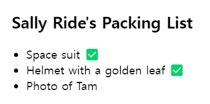

## 조건부로 JSX 반환하기

- `if/else 문`

```javascript
function Item({ name, isPacked }) {
  if (isPacked) {
    return <li className="item">{name} ✅</li>;
  }
  return <li className="item">{name}</li>;
}

export default function PackingList() {
  return (
    <section>
      <h1>Sally Ride's Packing List</h1>
      <ul>
        <Item isPacked={true} name="Space suit" />
        <Item isPacked={true} name="Helmet with a golden leaf" />
        <Item isPacked={false} name="Photo of Tam" />
      </ul>
    </section>
  );
}
```



## 조건부로 null을 사용해 아무것도 반환하지 않기

```javascript
if (isPacked) {
  return null;
}
return <li className="item">{name}</li>;
```


## 삼항 조건 연산자

```javascript
return <li className="item">{isPacked ? name + " ✅" : name}</li>;
```

-> isPacked가 참이면 (?) name + ' ✔'을 렌더링하고,  
그렇지 않으면 (:) name을 렌더링한다.

## 논리 AND 연산자 (&&)

- 왼쪽(조건)이 **_true_**이면 오른쪽(체크 표시)의 값을 반환
- 조건이 **_false_**이면 전체 표현 식이 false가 된다.

`&&`를 사용하면 isPacked가 true인 경우에만 조건부로 체크 표시를 렌더링할 수 있다.

```javascript
return (
  <li className="item">
    {name} {isPacked && "✅"}
  </li>
);
```

-> isPacked이면 (&&) 체크 표시를 렌더링하고, 그렇지 않으면 아무것도 렌더링하지 않는다.
