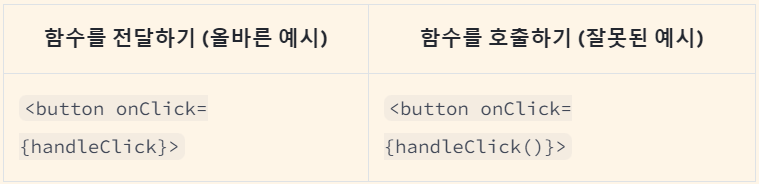

## 이벤트 핸들러

: 클릭, 마우스 호버, 홈 인풋 포커스 등 **사용자 상호작용**에 따라 유발되는 사용자 정의 함수

## 이벤트 핸들러 추가하기

먼저 함수를 정의하고,  
 이를 적절한 J**SX 태그에 prop 형태**로 전달해야 한다.

1.  `Button` 컴포넌트 내부에 `handleClick` 함수를 선언
2.  해당 함수 내부 로직을 구현. 메시지를 표시하기 위해 `alert`를 사용.

3.  `<button>` JSX에 onClick={handleClick}을 추가.

#### App.js

```javascript
export default function Button() {
  function handleClick() {
    alert("You clicked me!");
  }

  return <button onClick={handleClick}>Click me</button>;
}
```

- `handleClick` 함수를 정의
- 이를 `<button>`에 prop 형태로 전달
- 여기서 `handleClick`은 이벤트 핸들러

### 이벤트 핸들러 특징

- 주로 컴포넌트 내부에서 정의됨
- handle로 시작하고 그 뒤에 이벤트명을 붙인 함수명을 가짐

        ex) onClick={handleClick},
            onMouseEnter={handleMouseEnter}

⚠️ 주의  
이벤트 핸들러로 전달한 함수들은 **호출이 아닌 전달**되어야 한다.



## 이벤트 핸들러 내에서 Prop 읽기

```javascript
function AlertButton({ message, children }) {
  return <button onClick={() => alert(message)}>{children}</button>;
}

export default function Toolbar() {
  return (
    <div>
      <AlertButton message="Playing!">Play Movie</AlertButton>
      <AlertButton message="Uploading!">Upload Image</AlertButton>
    </div>
  );
}
```

## 이벤트 핸들러를 Prop으로 전달하기

```javascript
function Button({ onClick, children }) {
  return <button onClick={onClick}>{children}</button>;
}

function PlayButton({ movieName }) {
  function handlePlayClick() {
    alert(`Playing ${movieName}!`);
  }

  return <Button onClick={handlePlayClick}>Play "{movieName}"</Button>;
}

function UploadButton() {
  return <Button onClick={() => alert("Uploading!")}>Upload Image</Button>;
}

export default function Toolbar() {
  return (
    <div>
      <PlayButton movieName="Kiki's Delivery Service" />
      <UploadButton />
    </div>
  );
}
```

- `Toolbar` 컴포넌트가 `PlayButton` 과 `UploadButton`을 렌더링
  - `PlayButton`은 `handlePlayClick`을 `Button`내 `onClick` prop으로 전달합니다.
  - `UploadButton`은 () => alert('Uploading!')을 `Button` 내 `onClick` prop으로 전달
