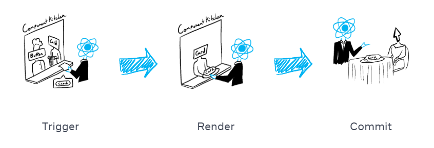

컴포넌트를 화면에 표시하기 이전에 React에서 **렌더링**을 해야한다.

1. 렌더링 **트리거**  
   (손님의 주문을 주방으로 전달)
2. 컴포넌트 **렌더링**  
   (주방에서 주문 준비하기)
3. DOM에 **커밋**  
   (테이블에 주문한 요리 내놓기)



## 1단계 : 렌더링 트리거

- 렌더링이 일어나는 이유
  - 컴포넌트의 **초기 렌더링인 경우**
  - 컴포넌트의 **state가 업데이트 된 경우**
    - ```set``` 함수를 통해 상태를 업데이트하여 추가적인 렌더링을 트리거할 수 O

## 2단계 : React 컴포넌트 렌더링
***“렌더링”은 React에서 컴포넌트를 호출하는 것***
- **초기 렌더링**에서 React는 루트 컴포넌트를 호출
- **이후 렌더링**에서 React는 state 업데이트가 일어나 렌더링을 트리거한 컴포넌트를 호출

## 3단계 : React가 DOM에 변경사항을 커밋
컴포넌트를 렌더링(호출)한 후 React는 DOM을 수정한다.
