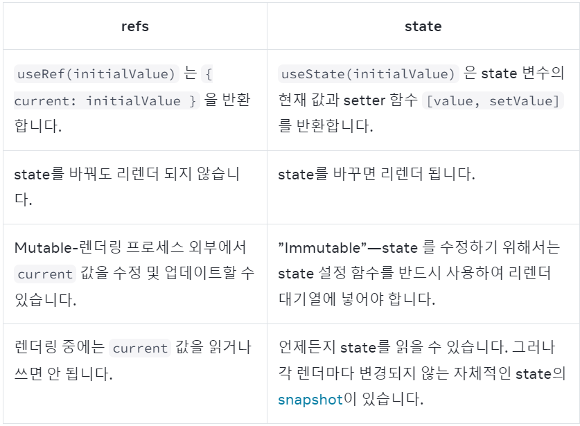

컴포넌트가 일부 정보를 **“기억”하고 싶지만**,  
 해당 정보가 **렌더링을 유발하지 않도록 하려면 ref를 사용**

 ## 컴포넌트에 ref 추가하기
 ```javascript
 import { useRef } from 'react';
 const ref = useRef(0);
 ```

- `useRef` 는 다음과 같은 객체를 반환
```javascript
{
  current: 0 // useRef에 전달한 값 
}
 ```
 - `ref.current` 프로퍼티를 통해 해당 ref의 current 값에 접근할 수 O  


## ref와 state의 차이 


## ref를 사용할 시기
컴포넌트가 **React**를 “외부”와 외부 API—컴포넌트의 형태에 영향을 미치지 않는 브라우저 **API** 와 통신해야 할 때 **ref**를 사용