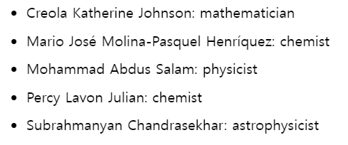

- `filter()`와 `map()`을 사용해 데이터 배열을 필터링하고 컴포넌트 배열로 변환하기.

  - `map()`을 사용하여 **_유사한 컴포넌트 집합_**을 생성
  - `filter()`를 사용하여 **_필터링된 항목의 배열_**을 생성

## 배열을 데이터로 렌더링하기

1. 데이터를 배열로 이동

2. people의 요소를 새로운 JSX 노드 배열인 listItems에 매핑한다.

3. `<ul>`로 래핑된 컴포넌트의 listItems를 반환한다.

```javascript
const people = [
  "Creola Katherine Johnson: mathematician",
  "Mario José Molina-Pasquel Henríquez: chemist",
  "Mohammad Abdus Salam: physicist",
  "Percy Lavon Julian: chemist",
  "Subrahmanyan Chandrasekhar: astrophysicist",
];

export default function List() {
  const listItems = people.map((person) => <li>{person}</li>);
  return <ul>{listItems}</ul>;
}
```



## 배열의 항목들을 필터링하기

1. people에서 `filter()`를 호출해 person.profession === 'chemist'로 필터링해서 **chemist**로만 구성된 새로운 배열 chemists를 생성한다.

2. `chemists`를 매핑한다.

3. 포넌트에서 `listItems`를 반환한다.

#### App.js

```javascript
import { people } from "./data.js";
import { getImageUrl } from "./utils.js";

export default function List() {
  const chemists = people.filter((person) => person.profession === "chemist");
  const listItems = chemists.map((person) => (
    <li>
      
      <p>
        <b>{person.name}:</b>
        {" " + person.profession + " "}
        known for {person.accomplishment}
      </p>
    </li>
  ));
  return <ul>{listItems}</ul>;
}
```

#### data.js

```javascript
export const people = [
  {
    id: 0,
    name: "Creola Katherine Johnson",
    profession: "mathematician",
    accomplishment: "spaceflight calculations",
    imageId: "MK3eW3A",
  },
  {
    id: 1,
    name: "Mario José Molina-Pasquel Henríquez",
    profession: "chemist",
    accomplishment: "discovery of Arctic ozone hole",
    imageId: "mynHUSa",
  },
  {
    id: 2,
    name: "Mohammad Abdus Salam",
    profession: "physicist",
    accomplishment: "electromagnetism theory",
    imageId: "bE7W1ji",
  },
  {
    id: 3,
    name: "Percy Lavon Julian",
    profession: "chemist",
    accomplishment:
      "pioneering cortisone drugs, steroids and birth control pills",
    imageId: "IOjWm71",
  },
  {
    id: 4,
    name: "Subrahmanyan Chandrasekhar",
    profession: "astrophysicist",
    accomplishment: "white dwarf star mass calculations",
    imageId: "lrWQx8l",
  },
];
```

## key를 사용해서 리스트 항복을 순서대로 유지하기

각 배열 항목에 다른 항목 중에서 고유하게 식별할 수 있는 문자열 또는 숫자를 key로 지정해야 한다.

💡 중요  
`map() 호출 내부의 JSX 엘리먼트에는 항상 key가 필요합니다! `

```javascript
export const people = [{
  id: 0, // JSX에서 key로 사용됨
  name: 'Creola Katherine Johnson',
  profession: 'mathematician',
  accomplishment: 'spaceflight calculations',
  imageId: 'MK3eW3A'
},...]
```

## key 규칙

- key는 형제 간에 고유해야 한다.
- key는 변경되어서는 안되며, 그렇게 되면 목적에 어긋난다.
